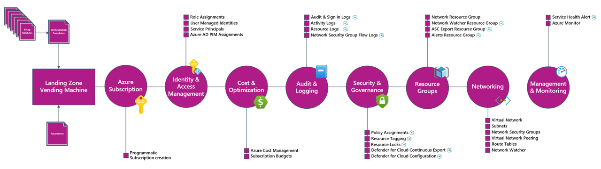

# Azure Landing Zones - Vending Machine

 

   

The following repository was built, curated and cared for by the wonderful teammates at Insight. 💗

<!-- markdownlint-disable -->

<!-- markdownlint-restore -->

## What is an Azure Landing Zone - Vending Machine

The associated artifacts in this repository are designed to accelerate deployment of an Azure Landing Zones within a Microsoft Entra tenant using a repeatable process (aka Vending Machine). Effectively, it allows you to deploy a subscription and key resources in it very quickly.

The process diagram below outlines the provisioning process.

<!-- markdownlint-disable MD045 MD033 -->

<!-- markdownlint-enable -->

The solution is designed to be instantiated many times, once for each
desired landing zone. This is split logically into the following capabilities:

- Subscription creation and placement into the desired Management Group
- Subscription tags
- Resource group tags
- Subscription role assignments
- Subscription budget
- Common resource groups `alertsRG`, `NetworkWatcherRG`, `ascExportRG`
- Action group in the `alertsRG` resource group
- Network watcher instance in the `NetworkWatcherRG` resource group
- Network resource group for spoke networking resources, including
  - Virtual network and associated subnets
  - Network security groups
  - Route tables
  - Hub & spoke connectivity (peering to a hub virtual network)
  - Virtual WAN connectivity (peering to a virtual hub via a virtual hub connection)
- Resource providers and resource providers features registration

## Related Repositories

The following repositories are related to the Azure Landing Zone Vending Machine reference implementation:

| Repository                        | Description                                                                                                                                    | Link                                                                                                        |
| --------------------------------- | ---------------------------------------------------------------------------------------------------------------------------------------------- | ----------------------------------------------------------------------------------------------------------- |
| Azure Landing Zones Documentation | All related design artifacts, including wikis, diagrams and templates for the Azure Landing Zone reference architecture.                       | [Azure Landing Zone Documentation](https://github.com/Insight-Services-APAC/azure-landing-zones-doco)       |
| Azure Landing Zones PlatformOps   | All related Infrastructure as Code that is complementary to the Application and Platform Landing Zones that will be used for Day 2 operations. | [Azure Landing Zones PlatformOps](https://github.com/Insight-Services-APAC/azure-landing-zones-platformOps) |

## Contributing

For information on how to contribute to this project, please see the [contribution guide](/CONTRIBUTING.md).

## Acknowledgements

This repository uses Intellectual Properties (IP) from several other repositories in the open-source community. For more information on these authors and their licenses, please see the [/NOTICE.txt](/NOTICE.txt) file.

## License

GNU GENERAL PUBLIC LICENSE - Version 3, 29 June 2007

See [License](/LICENSE).

## Local Development

For information of how to build and deploy this Infrastructure as Code using VSCode (F5/Run and Debug) functionality, please see the [docs/wiki/LocalDev.md](/docs/wiki/LocalDev.md) file.

<!-- markdownlint-disable MD013 -->

> **IMPORTANT:** The below example requires you have cloned/downloaded the entire repo and have it available at run-time on the machine running the below commands. It is also expected you are in the root of the cloned/extracted repository; otherwise paths will need to be changed in the below example.The parameter file is an example and should be changed to reflect what you need.

<!-- markdownlint-enable -->

## Getting Started with a Customer Deployment

> **NOTE:**
> These instructions are very important to prevent accidental IP oversharing so please follow these instructions fully.

Please follow these instructions to copy/clone this repository to a customer site.

1. Download this artefact/repository as a ZIP archive
1. Open and export the ZIP archive to local disk.
1. Delete the entire folders:
   - `.local`, and
   - `.git` (this is a hidden folder in the root `/`).
1. Delete these instructions under this heading `## Getting Started with a Customer Deployment`
1. Delete the instructions under this heading also `## Local Development`.
1. Upload this modified artefact to the customer site.
