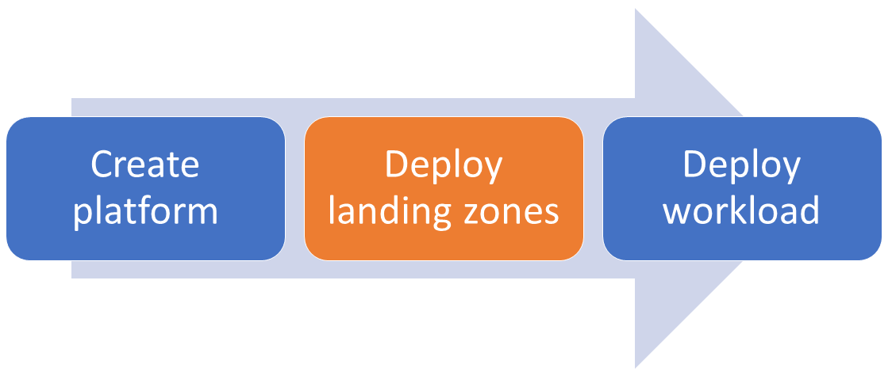

<!-- markdownlint-disable MD041 -->

# Home

Welcome to the wiki of the Azure Landing Zone - Vending Machine. This repository can be used standalone, or combined with the [Insight Platform Landing Zones][alz_bicep_module] to create a landing zone within the [Azure Landing Zones conceptual architecture][alz_conceptual_arch].

## Overview

<!-- markdownlint-disable MD033 -->

<!-- markdownlint-enable -->

In the above diagram, this repository provides the capability to address Subscription
Vending (subscriptions) and the core resources, e.g. networking components.

We recommend that you deploy the platform using the [Azure Landing Zones Bicep modules][alz_bicep_module]
and then use this module to deploy the landing zones.

Before deployment, please review the [required permissions](../wiki/permissions).
Then to get started, look at one of the [examples](../wiki/examples).

[alz_conceptual_arch]: https://aka.ms/alz#azure-landing-zone-conceptual-architecture
[alz_bicep_module]: https://github.com/Insight-Services-APAC/azure-landing-zones-bicep

## Getting Started

To get started with Azure Data Landing Zone, start with [Getting Started](GettingStarted.md) and [Local Development](LocalDev.md) for:

- Getting a baseline understanding of how to develop code, commit with Git, branch and merge, configure Bicep, YAML and more.
- Completing the prerequisites and dependencies for the overall implementation.
- High-level deployment flow.
- Links to more detailed instructions on individual modules.

> **Note:** _Minimum skill requirements to get started_
>
> At minimum, you should be familiar with using VSCode and have some coding experience with YAML, Bicep and PowerShell.

## Repository Details

The following section outlines the contents and specific set up for this repository.

### Folder Structure

The structure of the repository is outlined below.

- **.azdo** - Folder for Azure DevOps pipelines for the solution.
- **.github** - Folder for GitHub Action pipelines for the solution.
- **.local** - Insight's local dev experience.
- **.vscode** - Folder for user and workspace settings for VS Code.
- **data** - Insight's supporting artefacts for the data ingestion/logic for this solution
- **docs** - Folder for markdown files for the repository.
- **scripts** - Folder for generic scripts for the repository.
- **src** - Folder for Bicep IaC modules and parameter files for the EDP solution.
  - **configuration** - Folder for all associated parameter files, segregated into the associated deployment area.
  - **modules** - Folder for all associated Bicep modules, segregated into the associated deployment area.`

### Branch Policies

A Branch policy is in place to prevent authoring and pushing changes to the `main` branch directly, this needs to be raised through a _Pull Request_. Settings for this policy include:

- Minimum of 1 reviewers
- Optionally check for linked work items on Pull Requests
- Ensure all comments are resolved on Pull Requests
- Automatically include the team as reviewers
